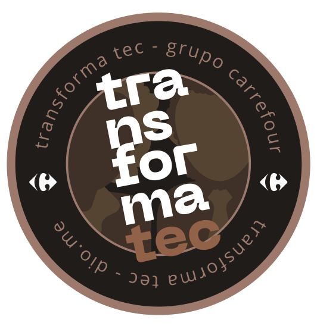

# TransformaTec

- Transforma Tec is a 100% free technology training program developed by Carrefour Brasil Grup in partnership with DIO.me. All course content will be based on fundamentals of the basic level in software development, with a focus on Full Stack development with Java, React and Cloud. With these learnings, you will be able to work in all stages of development projects, being in database, server, cloud storage and others, that is, I will learn from scratch the concepts of back-end and front-end.
 

## Display Flex Project

## Facebook Login Screen

## Dark Mode

## Traffic light react

## Todo list react

[//]: # (Programador e desenvolvedor Full-Stack certificado pelo programa de capacitação TransformaTec ofertado pelo Digital Inovation One. Estudante de Análise e Desenvolvimento de Sistemas UNINTER )
